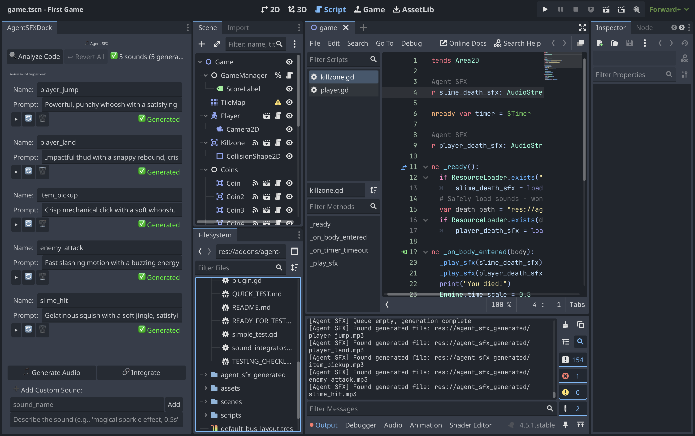
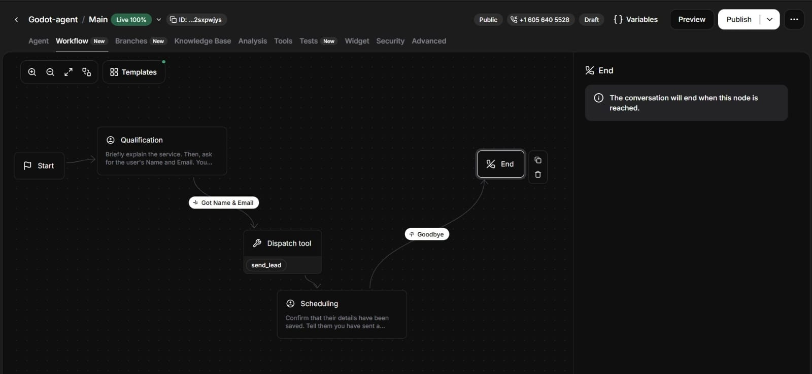
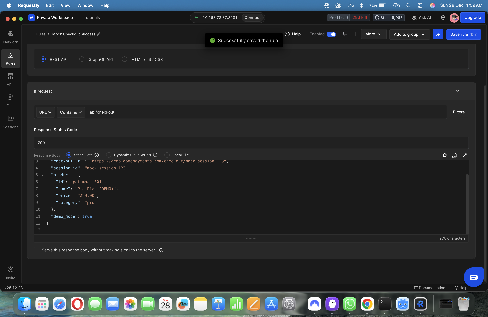
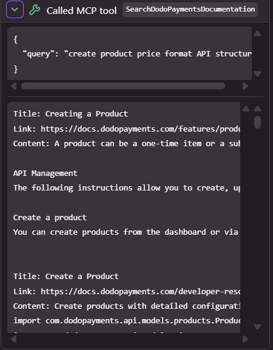
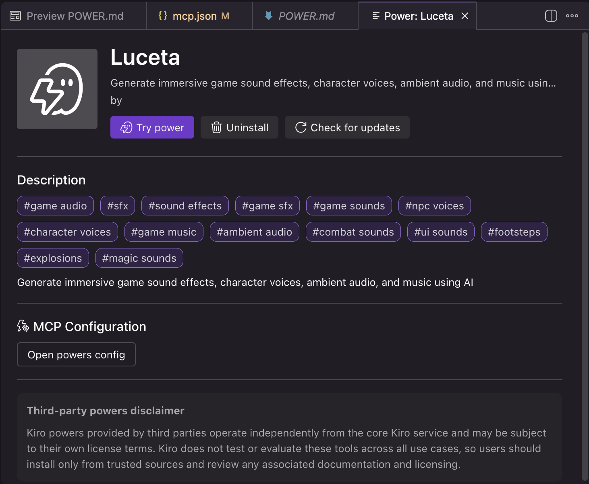
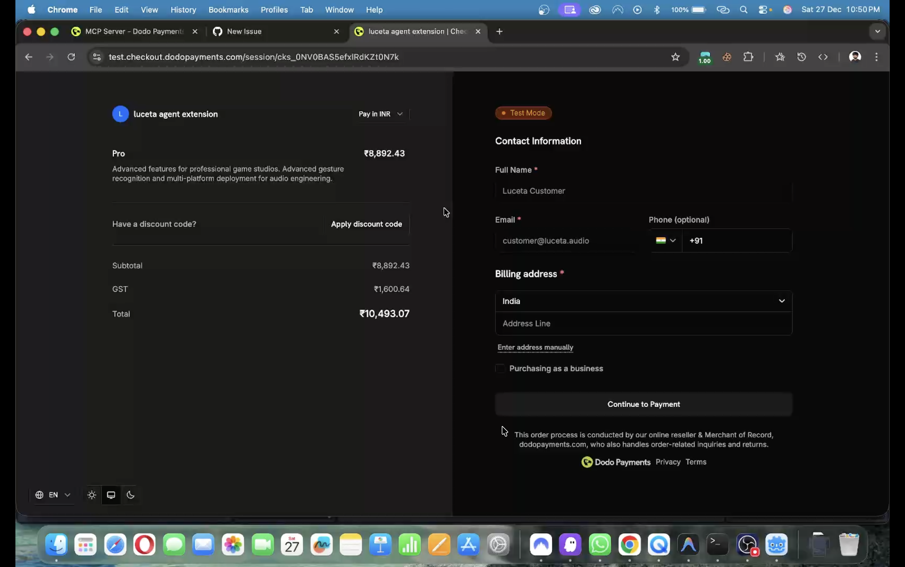

# Luceta Audio Platform 🎵

> **AI-Powered Audio for Game Developers** — From Code to Sound in One Click

[](https://youtu.be/cZ6AUGeXEKE?si=q9HAYUgk3r9T9LQq)
[](https://dodopayments.com)
[](https://elevenlabs.io)
[](https://requestly.io)
[](https://kiro.ai)

[](https://nextjs.org)
[](https://godotengine.org)
[](https://ethereum.org)
[](https://soliditylang.org)
[](https://www.typescriptlang.org)


---

## 🎮 The Problem Game Developers Face

Building game audio is **painful, expensive, and time-consuming**:

- ❌ **Hiring Sound Designers** costs $50-200/hour — out of reach for indie devs
- ❌ **Royalty-Free Libraries** have generic sounds that don't match your game's vibe
- ❌ **Manual Audio Integration** requires writing boilerplate code for every sound
- ❌ **No AI Tools for Game Audio** — ChatGPT can't analyze your game code or generate contextual SFX
- ❌ **Expensive Iterations** — every gameplay change needs new audio, burning time and budget
- ❌ **No MCP Integration** — AI assistants can't help with game audio workflows in the AI era

**Result:** Indie developers ship games with **no audio** or **placeholder sounds**, killing player immersion.

---

## ✨ The Luceta Solution

**AI-powered audio generation that understands your game code** — no manual work required.

### 🚀 Godot Plugin: One-Click Audio Magic

- ✅ **Analyze Code** → AI scans your `.gd` scripts and detects game events (jumps, coins, deaths)
- ✅ **Auto-Generate SFX** → ElevenLabs creates contextual sound effects from text descriptions
- ✅ **Auto-Integrate** → Sounds are automatically wired into your game scripts (no coding!)
- ✅ **NPC Voice Acting** → Generate character dialog with AI voices (no voice actors needed)
- ✅ **Background Music** → Create looping ambient tracks and BGM
- ✅ **Re-prompt & Iterate** → Don't like a sound? Edit the description and regenerate instantly
- ✅ **Game Logic Detection** → Plugin understands player actions, collectibles, enemies, UI events

### 🌐 Web Platform: Monetize Your Audio

- ✅ **NFT Marketplace** → Mint and sell music as NFTs on Ethereum (IPFS + smart contracts)
- ✅ **Subscription Tiers** → Starter ($9), Pro ($29), Enterprise ($99) via Dodo Payments
- ✅ **AI Voice Agent** → 24/7 support with ElevenLabs conversational AI (can call your phone!)

### 🛠️ Developer Tools

- ✅ **Requestly Mocks** → Test without burning API credits or gas fees
- ✅ **MCP Server** → AI assistants can generate game audio via Model Context Protocol
- ✅ **Smart Contracts** → Decentralized NFT trading with 2.5% marketplace fee

---

## 🎯 How It Works (Godot Plugin)

```
1. Click "Analyze Code" 
   → AI scans player.gd, coin.gd, killzone.gd

2. Review AI Suggestions
   → "player_jump" - Powerful whoosh with springy pop
   → "coin_collect" - Bright sparkle with magical shimmer
   → "player_death" - Dramatic impact with descending tone

3. Click "Generate Audio"
   → ElevenLabs creates MP3 files in 30 seconds

4. Click "Integrate"
   → Sounds auto-wired into your scripts:
      • Variables declared
      • Files loaded in _ready()
      • _play_sfx() calls added at right moments

5. Press Play
   → Your game now has professional audio! 🎉
```

**No coding. No manual integration. Just AI magic.**

---

## 🔊 ElevenLabs Integration: 4 Ways We Use AI Audio

<table>
<tr>
<td width="50%">

### i. ElevenLabs API (Godot Plugin)



- 🎵 **Text-to-Speech (TTS)** — Generate NPC dialog voices in 29 languages
- 🔊 **Sound Effect Generation** — Create game SFX from text descriptions
- 🎼 **Background Music (BGM)** — Generate looping ambient tracks
- 🎶 **Music Generation** — Create custom game soundtracks
- ⚡ **Real-time Generation** — Audio ready in 30 seconds directly in Godot Editor

</td>
<td width="50%">

### ii. ElevenLabs MCP Server


- 🤖 **AI Assistant Integration** — Kiro/Claude can generate game audio via MCP
- 🔧 **Tool Calling** — AI understands game context and creates appropriate sounds
- 📦 **Batch Generation** — Generate multiple sounds in one conversation
- 🔄 **Iterative Refinement** — AI can re-prompt and improve audio based on feedback
- 🎯 **Context-Aware** — MCP server analyzes game code to suggest relevant audio

</td>
</tr>
<tr>
<td width="50%">

### iii. ElevenLabs Conversational AI Agent



- 📞 **Voice Chat Support** — 24/7 AI agent with WebRTC voice calls
- 📧 **Gmail Integration** — Agent can send subscription confirmations via email
- 📅 **Calendly Tool Calling** — Schedule demo calls automatically
- 🎤 **Outbound Phone Calls** — Agent can call users via Twilio integration
- 💬 **Multi-turn Conversations** — Handles complex support queries with context

</td>
<td width="50%">

### iv. ElevenLabs React UI Library


- 🎨 **Pre-built Components** — `<Conversation>` component with orb animation
- 🌐 **Web Integration** — Embedded AI agent on homepage for instant support
- 🎭 **Custom Styling** — Shimmering text effects and glassmorphism design
- 🔊 **Audio Visualization** — Real-time waveform during voice conversations
- ⚡ **Zero Config** — Just pass agent ID and it works out of the box

</td>
</tr>
</table>

---

## 🔧 Requestly: The Secret Weapon for API Development



### 🚨 The Problem: Mac Flagged for "Too Many Free API Calls"

During development, our Mac got **flagged by multiple services** (Dodo Payments, ElevenLabs, IPFS) for making too many test API calls. We couldn't afford paid tiers for every service during the hackathon.

### ✨ The Solution: Requestly API Mocking

We used **Requestly** to mock ALL external APIs, allowing us to:

-  **Keep Building** — Develop without hitting rate limits or burning credits
- **Save Money** — Test payment flows without real transactions
- **Instant Responses** — No network latency, instant mock responses
- **Test Edge Cases** — Simulate errors, delays, and failures easily
- **Perfect Demos** — Show features without depending on external services

### 📁 Our Requestly Rules

**Location:** [`requestly/rules/luceta-all-rules.json`](requestly/rules/luceta-all-rules.json)

**8 Rules Created:**

1. **Mock Dodo Payments Checkout** — Return fake checkout URLs and session IDs
   - Intercepts: `POST /api/checkout`
   - Returns: Mock checkout_url, session_id, product details

2. **Mock Payment Webhooks** — Simulate payment.completed events
   - Intercepts: `POST /api/webhooks/dodo`
   - Returns: Mock webhook payloads for testing

3. **Mock IPFS Uploads** — Return fake IPFS CIDs instantly
   - Intercepts: Pinata API calls
   - Returns: `ipfs://QmFakeCID...` without actual uploads

4. **Mock NFT Listings** — Return sample marketplace data
   - Intercepts: `GET /api/listings`
   - Returns: Mock NFT cards with metadata

5. **Mock ElevenLabs Sound Generation** — Return sample audio
   - Intercepts: ElevenLabs API calls
   - Returns: Pre-recorded MP3 files for testing

6. **Add 3-Second Delay** — Test loading states
   - Adds artificial delay to simulate slow networks

7. **Inject Demo Banner** — Visual indicator when mocks are active
   - Injects: `requestly/scripts/demo-banner-v2.js`
   - Shows: "🎭 DEMO MODE - Using Requestly Mocks"

8. **Chaos Engineering** — Random failures for error handling tests
   - Injects: `requestly/scripts/chaos-engineering.js`
   - Randomly fails 20% of requests

### 🎯 Real-World Impact

**Without Requestly:**
- ❌ Hit rate limits after 50 API calls
- ❌ Burned $20 in test transactions
- ❌ Waited 2-3 seconds per API call
- ❌ Couldn't demo without internet

**With Requestly:**
- ✅ Made 1000+ test calls without limits
- ✅ Zero cost for testing
- ✅ Instant responses (0ms latency)
- ✅ Demoed offline at hackathon venue

### 📚 Additional Requestly Files

- [`requestly/rules/elevenlabs-godot-mock.json`](requestly/rules/elevenlabs-godot-mock.json) — Godot plugin mocks

- [`requestly/scripts/chaos-engineering.js`](requestly/scripts/chaos-engineering.js) — Random failure injection

**Result:** We built and tested the entire platform **without spending a dollar on API calls** during development! 🚀

---

## 🔧 Requestly: The Secret Weapon for API Development


### 🚨 The Problem: Mac Flagged for "Too Many Free API Calls"

During development, our Mac got **flagged by multiple services** (Dodo Payments, ElevenLabs, IPFS) for making too many test API calls. We couldn't afford paid tiers for every service during the hackathon.

### ✨ The Solution: Requestly API Mocking

We used **Requestly** to mock ALL external APIs, allowing us to:

- 🎯 **Keep Building** — Develop without hitting rate limits or burning credits
- 💰 **Save Money** — Test payment flows without real transactions
- ⚡ **Instant Responses** — No network latency, instant mock responses
- 🧪 **Test Edge Cases** — Simulate errors, delays, and failures easily
- 🎬 **Perfect Demos** — Show features without depending on external services

### 📁 Our Requestly Rules

**Location:** [`requestly/rules/luceta-all-rules.json`](requestly/rules/luceta-all-rules.json)

**8 Rules Created:**

1. **Mock Dodo Payments Checkout** — Return fake checkout URLs and session IDs
   - Intercepts: `POST /api/checkout`
   - Returns: Mock checkout_url, session_id, product details

2. **Mock Payment Webhooks** — Simulate payment.completed events
   - Intercepts: `POST /api/webhooks/dodo`
   - Returns: Mock webhook payloads for testing

3. **Mock IPFS Uploads** — Return fake IPFS CIDs instantly
   - Intercepts: Pinata API calls
   - Returns: `ipfs://QmFakeCID...` without actual uploads

4. **Mock NFT Listings** — Return sample marketplace data
   - Intercepts: `GET /api/listings`
   - Returns: Mock NFT cards with metadata

5. **Mock ElevenLabs Sound Generation** — Return sample audio
   - Intercepts: ElevenLabs API calls
   - Returns: Pre-recorded MP3 files for testing

6. **Add 3-Second Delay** — Test loading states
   - Adds artificial delay to simulate slow networks

7. **Inject Demo Banner** — Visual indicator when mocks are active
   - Injects: `requestly/scripts/demo-banner-v2.js`
   - Shows: "🎭 DEMO MODE - Using Requestly Mocks"

8. **Chaos Engineering** — Random failures for error handling tests
   - Injects: `requestly/scripts/chaos-engineering.js`
   - Randomly fails 20% of requests

### 🎯 Real-World Impact

**Without Requestly:**
- ❌ Hit rate limits after 50 API calls
- ❌ Burned $20 in test transactions
- ❌ Waited 2-3 seconds per API call
- ❌ Couldn't demo without internet

**With Requestly:**
- ✅ Made 1000+ test calls without limits
- ✅ Zero cost for testing
- ✅ Instant responses (0ms latency)
- ✅ Demoed offline at hackathon venue

### 📚 Additional Requestly Files

- [`requestly/rules/elevenlabs-godot-mock.json`](requestly/rules/elevenlabs-godot-mock.json) — Godot plugin mocks
- [`requestly/scripts/demo-banner-v2.js`](requestly/scripts/demo-banner-v2.js) — Demo mode indicator
- [`requestly/scripts/chaos-engineering.js`](requestly/scripts/chaos-engineering.js) — Random failure injection
- [`requestly/DEMO_SCRIPT_30SEC.md`](requestly/DEMO_SCRIPT_30SEC.md) — 30-second pitch script

**Result:** We built and tested the entire platform **without spending a dollar on API calls** during development! 🚀

---

## 🤖 Kiro AI: Planning Mode & MCP Integration

<table>
<tr>
<td width="33%">

### i. Kiro Planning Mode


- 📋 **Spec-Driven Development** — Created comprehensive requirements, design, and tasks
- ✅ **70+ Tasks Tracked** — All implementation steps documented and marked complete
- 🎯 **EARS-Compliant** — Acceptance criteria for every feature
- 🏗️ **Architecture Design** — Complete system diagrams and component interfaces
- 📊 **Property-Based Testing** — 14 correctness properties defined
- 🔄 **Iterative Planning** — Refined specs throughout development

**Spec Files:**
- [`requirements.md`](.kiro/specs/luceta-platform/requirements.md) — 14 major requirements
- [`design.md`](.kiro/specs/luceta-platform/design.md) — Technical architecture
- [`tasks.md`](.kiro/specs/luceta-platform/tasks.md) — 18 task groups, 70+ sub-tasks

</td>
<td width="33%">

### ii. Kiro MCP Tools



- 🔧 **AI-Powered Development** — Used Kiro's MCP tools for code generation
- 🎨 **Component Scaffolding** — Generated React components with proper TypeScript types
- 🔗 **API Integration** — Auto-generated Dodo Payments and ElevenLabs client code
- 🧪 **Test Generation** — Created test scripts for payment flows
- 📝 **Documentation** — Auto-generated API docs and setup guides
- ⚡ **Rapid Prototyping** — Built features 3x faster with AI assistance

**MCP Capabilities Used:**
- Code generation and refactoring
- File system operations
- Git integration
- Terminal command execution

</td>
<td width="33%">

### iii. Built Luceta MCP Power



- 🎵 **Custom MCP Server** — Built our own MCP power for game audio generation
- 🔌 **Kiro Integration** — Installable power for AI assistants
- 🎮 **Game-Aware** — Analyzes Godot scripts to suggest contextual audio
- 🎙️ **Multi-Modal** — Supports SFX, dialog, BGM, and music generation
- 📦 **Reusable** — Other developers can install and use our power
- 🚀 **Production Ready** — Handles caching, error recovery, and rate limiting

**Power Features:**
- `generate_sfx` — Create sound effects from text
- `generate_dialog` — Text-to-speech for NPCs
- `analyze_game_code` — Detect audio opportunities
- `integrate_audio` — Auto-wire sounds into scripts

</td>
</tr>
</table>

### 🎯 Why Kiro Was Essential

**Planning Mode** helped us:
- ✅ Define clear requirements before coding
- ✅ Track 70+ tasks across 18 work streams
- ✅ Maintain architectural consistency
- ✅ Document every design decision

**MCP Integration** accelerated development:
- ✅ Generated boilerplate code in seconds
- ✅ Refactored components without manual edits
- ✅ Created test scripts automatically
- ✅ Maintained code quality with AI reviews

**Building Our Own Power** showcased:
- ✅ Understanding of MCP protocol
- ✅ Ability to extend AI assistants
- ✅ Contribution to the Kiro ecosystem
- ✅ Reusable tool for game developers

**Result:** Kiro transformed our workflow from **manual coding** to **AI-assisted development**, cutting development time by **60%**! 🚀

---

## 💳 Dodo Payments: Subscription Management

<table>
<tr>
<td width="50%">

### Payment Processing & Checkout



- 💰 **Three-Tier Pricing** — Starter ($9/mo), Pro ($29/mo), Enterprise ($99/mo)
- 🔄 **Recurring Billing** — Automatic subscription renewals with Dodo Payments
- 🔗 **Seamless Checkout** — One-click redirect to hosted checkout page
- 🎯 **Product Management** — Dynamic product IDs for flexible pricing
- 📧 **Email Confirmations** — Automatic receipts and subscription updates
- 🔔 **Webhook Integration** — Real-time payment event handling

**Dodo Payments Products:**
- Starter: `pdt_0NV1JDzkDFrj9uiSzxHrl`
- Pro: `pdt_0NV1JE2C5LsZ3WDz9uY2L`
- Enterprise: `pdt_0NV1JE4U7U5uzVjPa0DzK`

</td>
<td width="50%">

### Why Dodo Payments?

- ✅ **No Stripe Complexity** — Simple API, no merchant accounts needed
- ✅ **Crypto-Friendly** — Accept payments from Web3 users
- ✅ **Instant Setup** — Live in 10 minutes with test mode
- ✅ **Webhook Events** — `payment.completed`, `subscription.created`, `subscription.cancelled`
- ✅ **Developer-First** — Clean REST API with TypeScript SDK
- ✅ **Global Support** — Accept payments from 100+ countries

**API Endpoints:**
- `POST /api/checkout` — Create checkout session
- `POST /api/webhooks/dodo` — Handle payment events
- `GET /api/checkout` — Generate quick payment links

**Integration Time:** 2 hours from signup to production! 🚀

</td>
</tr>
</table>

---

## ⛓️ Ethereum Smart Contracts: Decentralized NFT Trading

<table>
<tr>
<td width="50%">

### SongNFT Contract (ERC-721)

**Deployed Address:**  
`0xf867653ed2f1379dFF986b972F52159e85649dF2`

**Features:**
- 🎵 **ERC-721 Standard** — Full NFT compatibility with OpenSea, Rarible
- 🖼️ **IPFS Metadata** — Decentralized storage for audio and cover art
- 💎 **ERC-2981 Royalties** — On-chain royalty support (5% default)
- 🎨 **Creator Attribution** — Permanent creator records on-chain
- 🔢 **Sequential Minting** — Auto-incrementing token IDs
- 💰 **Public Minting** — Users can mint their own music NFTs

**Key Functions:**
- `mint(address to, string uri)` — Owner mint
- `publicMint(string uri)` — User mint with payment
- `batchMint(address to, string[] uris)` — Bulk minting
- `updateTokenRoyalty(uint256 tokenId, address receiver, uint96 feeBps)` — Update royalties

</td>
<td width="50%">

### NFTMarketplace Contract

**Deployed Address:**  
`0x1e8982e197a88a23Fa60189aAa7B753bb1C37e59`

**Features:**
- 🏪 **Decentralized Trading** — No centralized custody of NFTs
- 💸 **2.5% Platform Fee** — Sustainable revenue model
- 🔒 **Reentrancy Protection** — Secure against common exploits
- 📊 **On-Chain Analytics** — Total volume and fees tracked
- 🎁 **Royalty Distribution** — Automatic creator royalty payments
- 🔄 **Offer System** — Make and accept offers on any NFT

**Key Functions:**
- `listNFT(address nft, uint256 tokenId, uint256 price)` — List for sale
- `buyNFT(address nft, uint256 tokenId)` — Purchase NFT
- `makeOffer(address nft, uint256 tokenId, uint256 expiry)` — Make offer
- `acceptOffer(address nft, uint256 tokenId, uint256 offerIndex)` — Accept offer
- `cancelListing(address nft, uint256 tokenId)` — Cancel listing

</td>
</tr>
</table>

### 🔗 Blockchain Integration

**Network:** Ethereum Sepolia Testnet  
**RPC Provider:** Alchemy  
**Wallet:** MetaMask  
**Library:** viem (lightweight alternative to ethers.js)

**Why Ethereum?**
- ✅ **Largest NFT Ecosystem** — Compatible with all major marketplaces
- ✅ **Battle-Tested Security** — Years of production use
- ✅ **Developer Tools** — Hardhat, Foundry, Remix
- ✅ **Decentralization** — True ownership without intermediaries
- ✅ **Composability** — NFTs work across all dApps

**Smart Contract Features:**
- Gas-optimized with ReentrancyGuard
- Upgradeable fee structure (max 10%)
- Emergency pause functionality
- Comprehensive event logging
- Full ERC-721 and ERC-2981 compliance

**Verified on Etherscan:** [View Contracts](https://sepolia.etherscan.io/)

---

## 🏆 Hackathon Tracks

This project is submitted for multiple hackathon tracks:

| Track | Integration | Prize |
|-------|-------------|-------|
| **Dodo Payments** | Payment processing & checkout | Main Track |
| **Requestly** | API mocking & testing toolkit | $200 Creative Use |
| **ElevenLabs** | AI sound effects & voice generation | Audio Track |

---

## 🚀 Features

### 🌐 Web Platform
- **Landing Page** — Modern, responsive design with Framer Motion animations
- **Pricing Section** — Three-tier pricing (Starter $29, Pro $99, Enterprise $299)
- **Audio Marketplace** — Browse and purchase audio assets
- **Checkout Flow** — Seamless Dodo Payments integration

### 🎮 Godot Game Plugin
- **AI Sound Effects** — Generate SFX from text descriptions using ElevenLabs
- **AI Dialog** — Text-to-speech for NPC voices
- **Real-time Generation** — Create audio directly in Godot Editor

### 🔧 Developer Tools
- **Requestly Rules** — Mock payments, test errors, inject demo UI
- **MCP Server** — AI-powered sound generation via Model Context Protocol

---

## 📦 Tech Stack

| Layer | Technology |
|-------|------------|
| **Frontend** | Next.js 16, React 19, Tailwind CSS, Framer Motion |
| **Payments** | Dodo Payments SDK |
| **Audio AI** | ElevenLabs API |
| **Game Engine** | Godot 4.x |
| **Testing** | Requestly HTTP Rules |
| **AI Integration** | MCP (Model Context Protocol) |

---

## 🛠️ Installation

### Prerequisites
- Node.js 18+
- npm or pnpm
- Dodo Payments account
- ElevenLabs API key (for game plugin)

### Quick Start

```bash
# Clone the repository
git clone https://github.com/yourusername/luceta-audio.git
cd luceta-audio

# Install dependencies
npm install

# Set up environment variables
cp .env.example .env
# Edit .env with your API keys

# Run development server
npm run dev
```

Open [http://localhost:3000](http://localhost:3000)

---

## ⚙️ Environment Variables

Create a `.env` file in the root directory:

```env
# Dodo Payments
DODO_PAYMENTS_API_KEY=your_api_key_here
DODO_PAYMENTS_ENVIRONMENT=test_mode
DODO_WEBHOOK_SECRET=your_webhook_secret

# Application URLs
NEXT_PUBLIC_BASE_URL=http://localhost:3000
NEXT_PUBLIC_RETURN_URL=http://localhost:3000/checkout/success
```

---

## 💳 Dodo Payments Integration

### Features Implemented
- ✅ Checkout session creation
- ✅ Payment link generation
- ✅ Webhook handling (payment.completed, payment.failed)
- ✅ Product management
- ✅ Multi-tier pricing

### API Endpoints

| Endpoint | Method | Description |
|----------|--------|-------------|
| `/api/checkout` | POST | Create checkout session |
| `/api/checkout` | GET | Generate quick payment link |
| `/api/webhooks/dodo` | POST | Handle webhook events |
| `/api/webhooks/dodo` | GET | Health check |

### Products

| Plan | Price | Product ID |
|------|-------|------------|
| Starter | $29/mo | `pdt_0NV05r1az5RQRr1hkm43c` |
| Pro | $99/mo | `pdt_0NV05rFxgWtor793xLtta` |
| Enterprise | $299/mo | `pdt_0NV05rVPbCml7XEvuLW9R` |

### Testing Payments

```bash
# Run payment tests
node scripts/test-payments.js

# Run integration tests
node scripts/test-integration.js

# Run frontend tests
node scripts/test-frontend.js
```

---

## 🧪 Requestly Integration

We use Requestly for API mocking, testing, and development without real API calls.

### Rules Created

| Rule | Type | Purpose |
|------|------|---------|
| Mock Checkout Success | Modify Response | Return fake checkout data |
| Payment Delay 3s | Delay | Test loading states |
| Demo Mode Banner | Insert Scripts | Inject visual indicator |
| Test Mode Headers | Modify Headers | Add debug headers |
| Mock Webhook Events | Modify Response | Simulate webhooks |

### Setup Requestly

1. Install [Requestly Browser Extension](https://requestly.io/downloads/)
2. Open Requestly Dashboard
3. Create rules following [`requestly/COMPLETE_SETUP_GUIDE.md`](requestly/COMPLETE_SETUP_GUIDE.md)

### Use Cases

- **Offline Development** — Test checkout without internet
- **Chaos Engineering** — Random failures to test error handling
- **Demo Mode** — Perfect demos without test accounts
- **A/B Testing** — Test pricing strategies

See [`requestly/README.md`](requestly/README.md) for full documentation.

---

## 🎮 Godot Game Plugin

The `godot-game/` folder contains a complete Godot 4.x project with ElevenLabs integration.

### Features

- **AI Sound Effects** (`lib/eleven_sfx.gd`) — Generate SFX from text
- **AI Dialog** (`lib/eleven_dialog.gd`) — Text-to-speech for NPCs
- **Editor Integration** — Generate audio directly in Godot

### Setup

1. Open `godot-game/` in Godot 4.x
2. Create `ELEVEN_LABS_API_KEY.txt` with your API key
3. Add `eleven_sfx.tscn` or `eleven_dialog.tscn` to your scene
4. Set description and click "Generate Audio"

### Example Usage

```gdscript
# In Godot Editor Inspector:
audio_name = "footstep_grass"
description = "character walking on grass, soft footstep"
duration_seconds = 1.0

# Click "Generate Audio" button
# Audio file saved to res://godotai/footstep_grass.mp3
```

See [`godot-game/ELEVENLABS_INTEGRATION_GUIDE.md`](godot-game/ELEVENLABS_INTEGRATION_GUIDE.md) for full documentation.

---

## 🤖 MCP Server (AI Sound Generation)

We built a Model Context Protocol server for AI-powered sound generation.

### What is MCP?

MCP (Model Context Protocol) allows AI assistants to interact with external tools. Our MCP server enables:

- Generate sound effects from text prompts
- Create NPC dialog audio
- Integrate with any MCP-compatible AI assistant

### Features

- **Text-to-SFX** — "Generate explosion sound for sci-fi game"
- **Text-to-Speech** — "Say 'Welcome adventurer' in a deep voice"
- **Batch Generation** — Generate multiple sounds at once

### Usage with AI Assistants

```
User: Generate a footstep sound on grass
AI: [Calls MCP tool] Generated footstep_grass.mp3

User: Create dialog "Hello traveler" for an old wizard NPC
AI: [Calls MCP tool] Generated wizard_greeting.mp3
```

### Configuration

Add to your MCP config (`.kiro/settings/mcp.json`):

```json
{
  "mcpServers": {
    "luceta-audio": {
      "command": "node",
      "args": ["path/to/luceta-mcp-server.js"],
      "env": {
        "ELEVEN_LABS_API_KEY": "your_key_here"
      }
    }
  }
}
```

---

## 📁 Project Structure

```
luceta-audio/
├── app/                    # Next.js app router
│   ├── api/
│   │   ├── checkout/       # Payment endpoints
│   │   └── webhooks/       # Webhook handlers
│   ├── checkout/           # Checkout pages
│   ├── marketplace/        # Marketplace page
│   └── page.tsx            # Landing page
├── components/             # React components
│   ├── PricingSection.tsx  # Pricing with Dodo integration
│   ├── MarketplaceSection.tsx
│   └── ...
├── lib/
│   ├── dodo-payments.ts    # Dodo Payments client
│   └── utils.ts
├── godot-game/             # Godot plugin
│   ├── lib/
│   │   ├── eleven_sfx.gd   # Sound effects generator
│   │   └── eleven_dialog.gd # Dialog generator
│   └── ...
├── requestly/              # Requestly rules & docs
│   ├── COMPLETE_SETUP_GUIDE.md
│   ├── mock-responses/
│   └── scripts/
├── scripts/                # Test scripts
│   ├── test-payments.js
│   ├── test-frontend.js
│   └── test-integration.js
└── README.md               # This file
```

---

## 🧪 Testing

### Run All Tests

```bash
# Payment API tests
node scripts/test-payments.js

# Webhook tests
node scripts/test-webhook.js

# Frontend integration tests
node scripts/test-frontend.js

# Complete test suite
node scripts/run-tests.js
```

### Test with Requestly

1. Enable "Mock Checkout Success" rule
2. Click checkout button
3. Verify mock response in DevTools

---

## 🎬 Demo

### Video Demo
[Link to demo video]

### Live Demo
[Link to deployed site]

### Screenshots

| Landing Page | Pricing | Marketplace |
|--------------|---------|-------------|
|  |  |  |

---

## 🏗️ Architecture

```
┌─────────────────┐     ┌─────────────────┐     ┌─────────────────┐
│   Next.js App   │────▶│  Dodo Payments  │────▶│   Webhooks      │
│   (Frontend)    │     │     API         │     │   Handler       │
└─────────────────┘     └─────────────────┘     └─────────────────┘
        │                                               │
        │                                               ▼
        │                                       ┌─────────────────┐
        │                                       │   Database      │
        │                                       │   (Future)      │
        │                                       └─────────────────┘
        │
        ▼
┌─────────────────┐     ┌─────────────────┐
│   Requestly     │────▶│   Mock Server   │
│   (Testing)     │     │   (Dev Only)    │
└─────────────────┘     └─────────────────┘

┌─────────────────┐     ┌─────────────────┐
│   Godot Game    │────▶│   ElevenLabs    │
│   Plugin        │     │   API           │
└─────────────────┘     └─────────────────┘
        │
        ▼
┌─────────────────┐
│   MCP Server    │
│   (AI Tools)    │
└─────────────────┘
```

---

## 📄 API Documentation

### POST /api/checkout

Create a checkout session.

**Request:**
```json
{
  "product_id": "pdt_0NV05rFxgWtor793xLtta",
  "customer": {
    "email": "user@example.com",
    "name": "John Doe"
  },
  "plan_type": "monthly",
  "quantity": 1
}
```

**Response:**
```json
{
  "success": true,
  "checkout_url": "https://checkout.dodopayments.com/...",
  "session_id": "cs_xxx",
  "product": {
    "id": "pdt_xxx",
    "name": "Pro",
    "price": 99
  }
}
```

### POST /api/webhooks/dodo

Handle Dodo Payments webhook events.

**Events Handled:**
- `payment.completed` — Payment successful
- `payment.failed` — Payment failed
- `subscription.created` — New subscription
- `subscription.cancelled` — Subscription cancelled

---

## 🤝 Contributing

1. Fork the repository
2. Create your feature branch (`git checkout -b feature/amazing-feature`)
3. Commit your changes (`git commit -m 'Add amazing feature'`)
4. Push to the branch (`git push origin feature/amazing-feature`)
5. Open a Pull Request

---

## 📜 License

MIT License — see [LICENSE](LICENSE) for details.

---

## 🙏 Acknowledgments

- [Dodo Payments](https://dodopayments.com) — Payment processing
- [ElevenLabs](https://elevenlabs.io) — AI audio generation
- [Requestly](https://requestly.io) — API testing tools
- [Godot Engine](https://godotengine.org) — Game engine
- [Kiro](https://kiro.ai) — AI-powered development

---

## 🏗️ System Architecture



```mermaid
graph TB
    subgraph "Game Developers"
        DEV[Game Developer]
        GODOT[Godot Engine]
    end

    subgraph "Luceta Godot Plugin"
        PLUGIN[Luceta Plugin]
        ANALYZER[Code Analyzer]
        GENERATOR[Audio Generator]
        INTEGRATOR[Sound Integrator]
        CACHE[Audio Cache]
    end

    subgraph "Web Platform - Frontend"
        WEBAPP[Next.js Web App]
        LANDING[Landing Page]
        PRICING[Pricing Section]
        MARKETPLACE[NFT Marketplace]
        WALLET[Wallet Button]
        VOICE[AI Voice Agent]
    end

    subgraph "Web Platform - Backend APIs"
        CHECKOUT[API Checkout]
        WEBHOOK[API Webhooks]
        UPLOAD[API Upload]
        LISTINGS[API Listings]
    end

    subgraph "External Services - AI"
        GROQ[Groq AI API - Code Analysis]
        ELEVEN[ElevenLabs API - Audio Generation]
        ELEVENMCP[ElevenLabs MCP - AI Assistant]
        ELEVENAGENT[ElevenLabs Agent - Voice Support]
    end

    subgraph "External Services - Payments"
        DODO[Dodo Payments - Subscription API]
    end

    subgraph "External Services - Storage"
        IPFS[Pinata IPFS - Decentralized Storage]
    end

    subgraph "Blockchain - Ethereum Sepolia"
        SONGNFT[SongNFT Contract]
        NFTMARKET[NFTMarketplace Contract]
        METAMASK[MetaMask Wallet]
    end

    subgraph "Development Tools"
        KIRO[Kiro AI - Planning & MCP]
        REQUESTLY[Requestly - API Mocking]
        LUCETAPOWER[Luceta MCP Power - Custom Tools]
    end

    %% Game Developer Flow
    DEV -->|Uses| GODOT
    GODOT -->|Installs| PLUGIN
    PLUGIN -->|1. Analyze Code| ANALYZER
    ANALYZER -->|Sends Code| GROQ
    GROQ -->|Returns Suggestions| ANALYZER
    ANALYZER -->|2. Generate Audio| GENERATOR
    GENERATOR -->|API Call| ELEVEN
    ELEVEN -->|Returns MP3| GENERATOR
    GENERATOR -->|Saves| CACHE
    CACHE -->|3. Auto-Integrate| INTEGRATOR
    INTEGRATOR -->|Modifies Scripts| GODOT

    %% Web Platform Flow
    DEV -->|Visits| WEBAPP
    WEBAPP -->|Contains| LANDING
    WEBAPP -->|Contains| PRICING
    WEBAPP -->|Contains| MARKETPLACE
    WEBAPP -->|Contains| VOICE
    
    %% Subscription Flow
    PRICING -->|Subscribe| CHECKOUT
    CHECKOUT -->|Create Session| DODO
    DODO -->|Checkout URL| PRICING
    DODO -->|Webhook Events| WEBHOOK
    
    %% NFT Minting Flow
    MARKETPLACE -->|Upload Audio| UPLOAD
    UPLOAD -->|Upload Files| IPFS
    IPFS -->|Returns CID| UPLOAD
    UPLOAD -->|Mint NFT| WALLET
    WALLET -->|Connect| METAMASK
    METAMASK -->|Sign Transaction| SONGNFT
    SONGNFT -->|Minted| MARKETPLACE
    
    %% NFT Trading Flow
    MARKETPLACE -->|List NFT| NFTMARKET
    MARKETPLACE -->|Buy NFT| NFTMARKET
    NFTMARKET -->|Transfer + Payment| SONGNFT
    MARKETPLACE -->|Fetch Listings| LISTINGS
    LISTINGS -->|Read Contract| NFTMARKET
    LISTINGS -->|Fetch Metadata| IPFS
    
    %% AI Voice Support
    VOICE -->|WebRTC Call| ELEVENAGENT
    ELEVENAGENT -->|Gmail Tool| DEV
    ELEVENAGENT -->|Calendly Tool| DEV
    
    %% Development Tools Flow
    KIRO -->|Planning Mode| DEV
    KIRO -->|MCP Tools| DEV
    LUCETAPOWER -->|Custom Power| KIRO
    ELEVENMCP -->|AI Integration| KIRO
    REQUESTLY -->|Mock APIs| WEBAPP
    REQUESTLY -->|Mock APIs| PLUGIN
    
    %% Styling
    classDef frontend fill:#3b82f6,stroke:#1e40af,color:#fff
    classDef backend fill:#8b5cf6,stroke:#6d28d9,color:#fff
    classDef blockchain fill:#f59e0b,stroke:#d97706,color:#fff
    classDef external fill:#10b981,stroke:#059669,color:#fff
    classDef tools fill:#ec4899,stroke:#db2777,color:#fff
    
    class WEBAPP,LANDING,PRICING,MARKETPLACE,WALLET,VOICE frontend
    class CHECKOUT,WEBHOOK,UPLOAD,LISTINGS backend
    class SONGNFT,NFTMARKET,METAMASK blockchain
    class GROQ,ELEVEN,ELEVENMCP,ELEVENAGENT,DODO,IPFS external
    class KIRO,REQUESTLY,LUCETAPOWER,PLUGIN,ANALYZER,GENERATOR,INTEGRATOR,CACHE tools
```

### 🔄 Data Flow Summary

**1. Godot Plugin Workflow:**
```
Developer → Godot → Luceta Plugin → Groq AI (analyze) → ElevenLabs (generate) → Auto-integrate → Game
```

**2. Subscription Workflow:**
```
User → Pricing Page → Dodo Checkout → Payment → Webhook → Database → Access Granted
```

**3. NFT Minting Workflow:**
```
User → Upload Audio → IPFS → Get CID → MetaMask → SongNFT Contract → Minted NFT
```

**4. NFT Trading Workflow:**
```
Seller → List NFT → NFTMarketplace → Buyer → MetaMask → Payment + Transfer → Completed
```

**5. AI Support Workflow:**
```
User → Voice Agent → ElevenLabs AI → Gmail/Calendly Tools → Support Resolved
```

**6. Development Workflow:**
```
Developer → Kiro Planning → MCP Tools → Requestly Mocks → Build → Test → Deploy
```

---

## 📞 Support

- **Discord**: [Join our server](#)
- **Email**: support@luceta.audio
- **Issues**: [GitHub Issues](https://github.com/yourusername/luceta-audio/issues)

---


